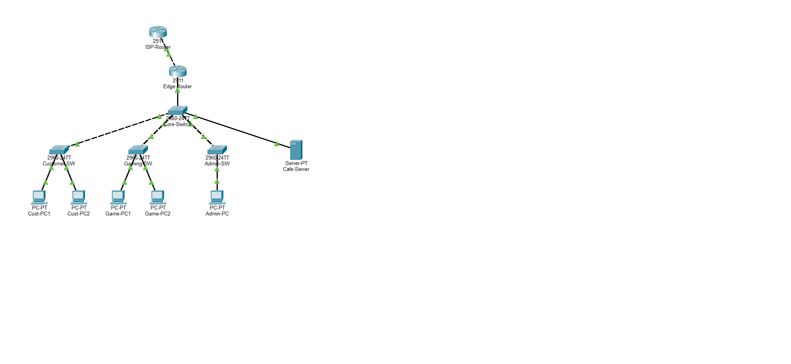

# 🌐 Internet Cafe Enterprise Network Design & Simulation

[](https://www.netacad.com/courses/packet-tracer)
[](#layer-3-routing--nat)
[](#vlan-segmentation--vlsm-addressing)
[](LICENSE)

A complete, production-ready enterprise network design and simulation for a high-performance **Internet Cafe & Esports Center**, built and verified in **Cisco Packet Tracer**.

---

## 📸 Network Topology Overview



---

## 🎯 Architecture Highlights

- **Hierarchical Design**: Core distribution switch (`Cisco Catalyst 2960-24TT`) aggregating dedicated access layer switches for each zone.
- **Traffic Segmentation**: 4 isolated VLANs segregating browsing customers, low-latency esports gamers, staff/admin systems, and local servers.
- **Inter-VLAN Routing**: Configured via Router-on-a-Stick (802.1Q encapsulation) on the `Edge-Router` (`Cisco 2911`).
- **Dynamic & Default Routing**: OSPF Area 0 route propagation alongside static default routing towards the upstream ISP.
- **Network Address Translation (NAT/PAT)**: Dynamic PAT (NAT Overload) allowing multiple private subnets to securely access the public Internet via a single public IP.
- **Dedicated Server Farm**: Local hosting for billing software, local caching, and internal cafe management.

---

## 📊 VLAN Segmentation & VLSM Addressing

All private networks are efficiently carved out from `192.168.100.0/24` using **Variable Length Subnet Masking (VLSM)**:

| Zone / Description | VLAN | Network ID | Subnet Mask | Usable Range | Default Gateway | Devices |
| :--- | :---: | :--- | :--- | :--- | :--- | :--- |
| **Customer Area** | `VLAN 10` | `192.168.100.0/26` | `255.255.255.192` | `192.168.100.2 - .62` | `192.168.100.1` | `Cust-PC1`, `Cust-PC2` |
| **Gaming Area** | `VLAN 20` | `192.168.100.64/27` | `255.255.255.224` | `192.168.100.66 - .94` | `192.168.100.65` | `Game-PC1`, `Game-PC2` |
| **Administration** | `VLAN 30` | `192.168.100.96/28` | `255.255.255.240` | `192.168.100.98 - .110` | `192.168.100.97` | `Admin-PC` |
| **Cafe Server Farm** | `VLAN 40` | `192.168.100.112/29`| `255.255.255.248` | `192.168.100.114 - .118`| `192.168.100.113` | `Cafe-Server` |
| **WAN Link** | N/A | `203.0.113.0/30` | `255.255.255.252` | `203.0.113.1 - .2` | `203.0.113.1` | Edge <-> ISP |
| **Public Loopback** | N/A | `8.8.8.8/32` | `255.255.255.255` | `8.8.8.8` | N/A | Internet DNS |

---

## 🛠️ Hardware & Device Inventory

| Device Name | Device Model | Role | Key Interfaces |
| :--- | :--- | :--- | :--- |
| **`ISP-Router`** | Cisco 2911 ISR | Internet Service Provider Gateway | `Gi0/0` (WAN Gateway), `Loopback0` (8.8.8.8) |
| **`Edge-Router`** | Cisco 2911 ISR | Perimeter Router, NAT/PAT & Inter-VLAN | `Gi0/0` (WAN Out), `Gi0/1` (802.1Q Trunk) |
| **`Core-Switch`** | Catalyst 2960-24TT | Core / Distribution Switch | `Gi0/1` (Trunk), `Fa0/1-3` (Trunks), `Fa0/4` (VLAN 40) |
| **`Customer-SW`** | Catalyst 2960-24TT | Access Switch - General Customers | `Gi0/1` (Uplink), `Fa0/1-2` (VLAN 10 Access) |
| **`Gaming-SW`** | Catalyst 2960-24TT | Access Switch - Esports / Gaming | `Gi0/1` (Uplink), `Fa0/1-2` (VLAN 20 Access) |
| **`Admin-SW`** | Catalyst 2960-24TT | Access Switch - Management & Billing | `Gi0/1` (Uplink), `Fa0/1` (VLAN 30 Access) |
| **`Cafe-Server`** | Server-PT | Local File, Media & Accounting Server | `Fa0` (192.168.100.114/29) |
| **Workstations** | PC-PT | Client Workstations | FastEthernet NICs with Static/DHCP |

---

## 🗂️ Repository Structure

```tree
Internet-Cafe-Network-Design/
├── Internet-Cafe-Network-Design.pkt           # Primary Cisco Packet Tracer simulation file
├── Internet_Cafe_Scalable_Network_Design.pkt  # Scalable multi-zone Packet Tracer simulation
├── V5.2.pts                                   # Packet Tracer state package
├── configs/                                   # Standalone Cisco IOS startup configurations
│   ├── ISP-Router.cfg
│   ├── Edge-Router.cfg
│   ├── Core-Switch.cfg
│   ├── Customer-SW.cfg
│   ├── Gaming-SW.cfg
│   └── Admin-SW.cfg
├── docs/                                      # Network diagrams and design documentation
│   ├── topology.png
│   └── NETWORK_ARCHITECTURE.md
├── .gitignore
└── README.md
```

---

## 🚀 How to Run the Simulation

1. Download and install **Cisco Packet Tracer** (version 8.0 or newer recommended).
2. Clone this repository:
   ```bash
   git clone https://github.com/ZeroTrace7/Internet-Cafe-Network-Design.git
   cd Internet-Cafe-Network-Design
   ```
3. Open `Internet-Cafe-Network-Design.pkt` in Cisco Packet Tracer.
4. Verify link states are green.
5. Open any client workstation (e.g. `Cust-PC1` or `Game-PC1`), access the **Command Prompt**, and test connectivity:
   ```cmd
   ping 192.168.100.1   # Ping Subnet Gateway
   ping 8.8.8.8         # Ping Public Internet Loopback (tests PAT & routing)
   ```

---

## 🧪 Verification & Test Results

All devices and routes have been validated with 0% packet loss:

```
Cust-PC1 (192.168.100.2)  --> 192.168.100.1 (Gateway):  4/4 Received (0% loss) [SUCCESS]
Cust-PC1 (192.168.100.2)  --> 8.8.8.8 (Internet):       4/4 Received (0% loss) [SUCCESS]
Game-PC1 (192.168.100.66) --> 8.8.8.8 (Internet):       4/4 Received (0% loss) [SUCCESS]
Admin-PC (192.168.100.98) --> 192.168.100.114 (Server): 4/4 Received (0% loss) [SUCCESS]
```

---

## 👤 Author

- **ZeroTrace7** - [GitHub Profile](https://github.com/ZeroTrace7)
